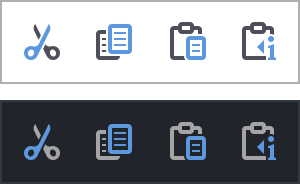
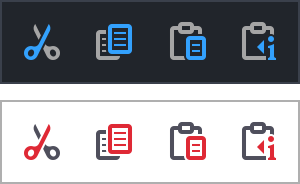

# Layered Font Icon Support For Java Swing / FlatLaf

For the version 0.2.0 readme, please check the _scala-version_ branch.

[](https://central.sonatype.com/search?smo=true&q=layeredfonticon&namespace=io.github.mimoguz)

This is a very basic multi-layer icon font utility that I extracted from another project of mine, for Java 17+. 
It lets you use your own font icons in Swing applications, optionally with multiple layers in one icon. 
Below screenshot shows several examples using the same three layers.


Another example that shows how "unset" colors change with the foreground color:



Layers can also take their colors from the UIManager, using a key. This is especially useful when using FlatLaf, which lets
you define such key-value pairs in the properties files. For example, let's assume we have two themes, light and dark.

In DarkTheme.properties:

    Theme.accent = #33A1FD

In LightTheme.properties:

    Theme.accent = #DF2935

We can now use "Theme.accent" to lookup colors.

```java
Layer.of(Symbol.CUT_ACCENT.text(), "Theme.accent")
```



Animated theme change in FlatLaf:


To see how to use, please check the demos, and documentation comments in the 

* [Layer.java](./src/layeredfonticon/src/main/java/io/github/mimoguz/layeredfonticon/Layer.java),
* [LayerColor.java](./src/layeredfonticon/src/main/java/io/github/mimoguz/layeredfonticon/LayerColor.java),
* [LayerColors.java](./src/layeredfonticon/src/main/java/io/github/mimoguz/layeredfonticon/LayerColors.java), and
* [LayeredFontIcon.java](./src/layeredfonticon/src/main/java/io/github/mimoguz/layeredfonticon/LayeredFontIcon.java)

files.

The _layeredfonticon_ project offers Java Swing support without any other dependencies.
The _layeredfonticon-flat_ project adds a little better support for the magnificent [FlatLaf](https://www.formdev.com/flatlaf/) look and feel.

## Basic usage

### Maven

In pom.xml, add

```xml
<dependencies>
    <dependency>
        <groupId>io.github.mimoguz</groupId>
        <artifactId>layeredfonticon</artifactId>
        <version>0.3.0</version>
    </dependency>
</dependencies>
```

to use the base version, or 

```xml
<dependencies>
    <dependency>
        <groupId>io.github.mimoguz</groupId>
        <artifactId>layeredfonticon</artifactId>
        <version>0.3.0</version>
    </dependency>
    <dependency>
        <groupId>io.github.mimoguz</groupId>
        <artifactId>layeredfonticon-flat</artifactId>
        <version>0.3.0</version>
    </dependency>
</dependencies>
```

to use FlatLaf specific version.
