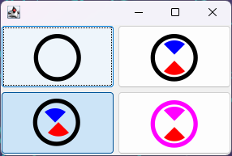

# Layered Font Icon Support For Java Swing / FlatLaf

This is a very basic layered font icon utility that I extracted from another project of mine, for Java 11+ and Scala 3. It lets you use your own font icons in Swing applications, optionally with multiple layers in one icon. Below screenshot shows several examples using the same three layers.



Another example that shows how "unset" colors change with the foreground color:


Layers can also take their colors from the UIManager, using a key. This is especially useful when using FlatLaf, which lets
you define such key-value pairs in the properties files. For example, let's assume we have two themes, light and dark.

In DarkTheme.properties:

    Theme.accent = #33A1FD

In LightTheme.properties:

    Theme.accent = #DF2935

We can now use "Theme.accent" to lookup colors.

Scala:

```scala
Layer(Symbol.CutAccent.text, LayerColor.FromKey("Theme.accent"))
```

Java:

```java
Layer.ofKey(Symbol.CUT_ACCENT.text(), "Theme.accent")
```


To see how to use, please check Java and Scala demos, and documentation comments in the [core/.../Layer.scala](./core/src/main/scala/io/github/mimoguz/layeredfonticon/Layer.scala) file.

The 'basic' project offers Java Swing support without any other dependencies. The 'flat' project adds a little better support for the magnificent [FlatLaf](https://www.formdev.com/flatlaf/) look and feel.

## Building

You will need JDK 11+ and [sbt](https://www.scala-sbt.org/index.html). Then, running

    sbt publishLocal

in the project root will publish the artefacts to your local ivy repository and list what's published. 
To publish to default Maven repository at ~/.m2, run

    sbt publishM2

instead. If you just want jars, run

    sbt package

and check the  "target/scala-3.2.1" directory.

## Basic usage

After publishing to your local repository, you can add it to project dependencies:

### Maven

In pom.xml, add

```xml
<dependencies>
    <dependency>
        <groupId>io.github.mimoguz</groupId>
        <artifactId>layeredfonticon-core_3</artifactId>
        <version>0.2.0</version>
    </dependency>
    <dependency>
        <groupId>io.github.mimoguz</groupId>
        <artifactId>layeredfonticon-basic_3</artifactId>
        <version>0.2.0</version>
    </dependency>
</dependencies>
```

to use the basic version, or 

```xml
<dependencies>
    <dependency>
        <groupId>io.github.mimoguz</groupId>
        <artifactId>layeredfonticon-core_3</artifactId>
        <version>0.2.0</version>
    </dependency>
    <dependency>
        <groupId>io.github.mimoguz</groupId>
        <artifactId>layeredfonticon-flat_3</artifactId>
        <version>0.2.0</version>
    </dependency>
</dependencies>
```

to use FlatLaf specific version.

### sbt

In build.sbt, add

```scala
libraryDependencies ++= Seq(
  "io.github.mimoguz" %% "layeredfonticon-core" % "0.2.0",
  "io.github.mimoguz" %% "layeredfonticon-basic" % "0.2.0"
)
```

to use the basic version, or

```scala
libraryDependencies ++= Seq(
  "io.github.mimoguz" %% "layeredfonticon-core" % "0.2.0",
  "io.github.mimoguz" %% "layeredfonticon-flat" % "0.2.0"
)
```

to use FlatLaf specific version.
